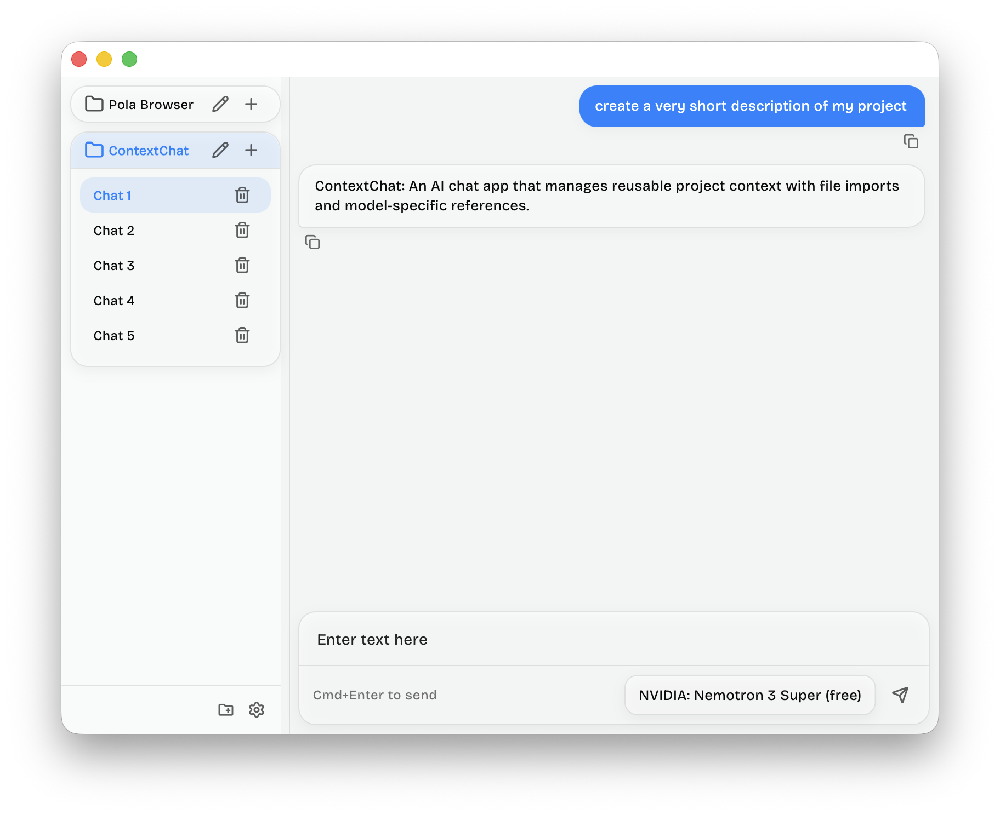
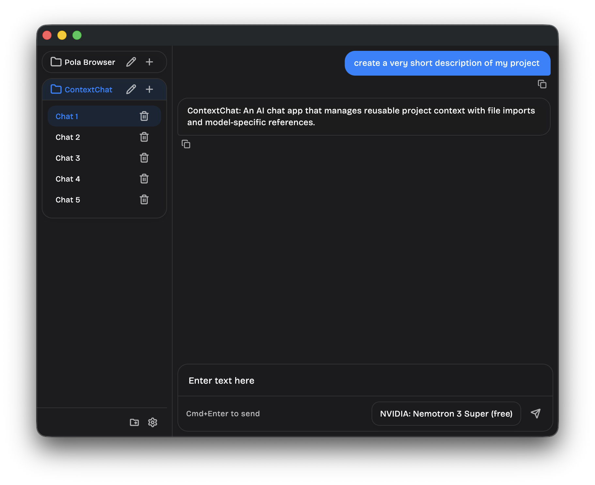
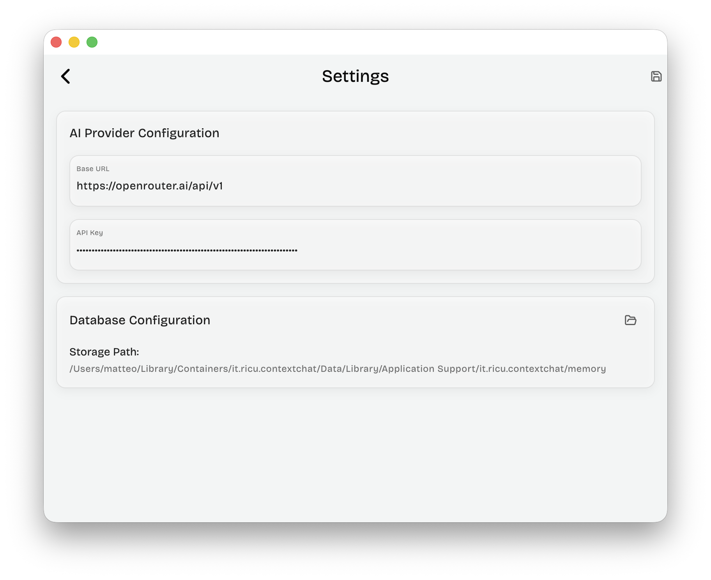
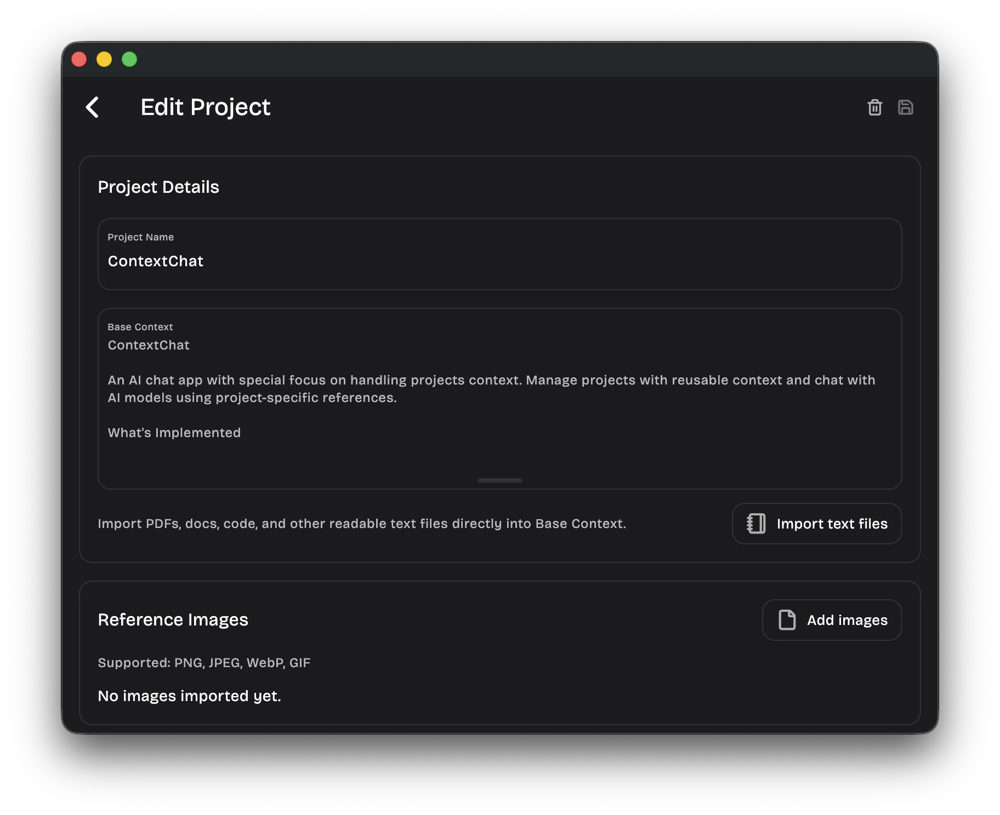

# ContextChat

ContextChat is a powerful AI interface designed for developers and power users who need project-specific AI assistance. It streamlines your workflow by automatically injecting project context, files, and reusable prompts into your conversations.

### Chat and settings

|                    Light                     |                    Dark                    |
| :------------------------------------------: | :----------------------------------------: |
|          |          |
|  |  |

---

## Key features

- Reusable instructions: Set base system prompts for each project.
- File knowledge: Import text files (PDF, code, docs) directly into the AI's context.
- Import from URL: Paste any URL to extract and import its content for AI context.
- Model defaults: Assign specific AI models to different projects.
- Local storage: All project data and files stay on your machine.
- OpenRouter integration: Access any model from OpenAI, Anthropic, Google, and more.
- Vision support: Drag and drop images into vision-capable models.
- Real-time streaming: Smooth, responsive message delivery.
- Context assembly: Automatically builds the prompt with project rules + files + history.
- Save and reuse: Build a library of frequently used prompts.
- Variables: Define variables in prompts for quick customization.
- Quick insert: Access your library directly from the chat composer.
- Pin and search: Keep your most important prompts at the top.
- Markdown support: Full rendering for code blocks and formatting.

---

## Local storage structure

ContextChat stores all data locally on your machine in a customizable directory (default: `memory/`). The storage structure is organized as follows:

- `memory/projects/` contains project configurations, system prompts, and model preferences.
- `memory/context/` stores imported files, URLs, and other context attached to projects.
- `memory/chats/` holds conversation histories organized by project.
- `memory/prompts/` saves your reusable prompt library.
- `memory/settings/` preserves your application preferences.

All data is stored as plain JSON files, making it easy to backup, sync with git, or migrate between machines.

---

## How context works

When you send a message, ContextChat automatically assembles a rich prompt:

1.  **System Prompt**: Your Project's base context instructions.
2.  **Files**: The content of all text files attached to the project.
3.  **Images**: Any images you've attached to the current message.
4.  **History**: Your previous messages for ongoing conversation flow.

---

## Roadmap

- [ ] **Search**: Full-text search across all chat histories.
- [ ] **Message Editing**: Edit and regenerate AI responses.
- [ ] **Multi-Provider**: Direct support for OpenAI, Anthropic, and Local (Ollama) APIs.
- [ ] **Theme Sync**: Manual toggle for Light/Dark modes.
- [ ] **Export**: Export conversations to Markdown or JSON.
- [ ] **Multi-platform**: Android, iOS, Linux, and Windows support.
- [ ] **Sync**: Sync projects and chats with cloud storage (iCloud, Google Drive, Dropbox).

---

Built with Flutter.
